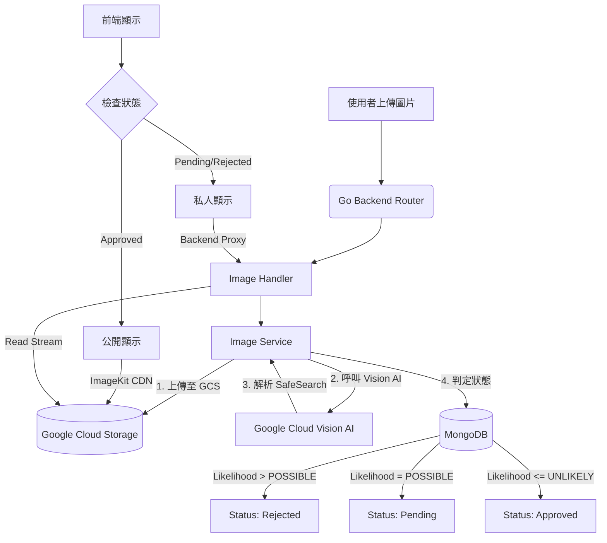

# TaiwanStay Go 後端開發指南 (v3.0 - MVP + GCP Image System)

本文檔整合了 GCP 圖片處理架構、專案架構、MVP 優先順序、API 遷移計畫與開發規範。此版本為最新準則。

---

## 1. MVP 開發優先順序 (Roadmap)

為確保核心功能快速上線，開發將嚴格依照以下優先順序進行。「組織 (Organization)」功能暫停。

### **Phase 0: 基礎建設 (Foundation)**
*   [x] [P0] 專案初始化 (Go Modules, Viper Config, .env 載入)。
*   [x] [P0] 資料庫連線 (MongoDB) 與全域錯誤處理機制。
*   [x] [P0] Log 系統建置 (log/slog)。
*   [x] [P0] GCP Client 初始化: 設定 GCS Storage Client 與 Vision API Client。

### **Phase 1: 用戶與認證 (Identity)**
*   [x] [P1] Auth: 註冊、登入 (JWT 核發)、密碼加密。
*   [x] [P1] Users: 用戶基本資料查詢 (不含圖片上傳)。

### **Phase 2: 圖片系統與供給端 (Image System & Supply)**
*   [x] [P2] Image System (Core):
    *   [x] 實作 GCS 上傳。
    *   [x] 整合 Google Vision API 進行自動審核。
    *   [x] 實作圖片狀態管理 (Pending/Approved/Rejected)。
*   [x] [P2] User Profile Update: 整合圖片系統，允許用戶上傳頭像。
*   [x] [P2] Hosts: 建立接待主資料 (含環境照片上傳)。
*   [x] [P2] Opportunities: 刊登工作機會 (含 GeoJSON 座標與照片)。

### **Phase 3: 核心需求端 (Applications)**
*   [x] [P3] Search: 基礎列表查詢 (支援分頁與地理位置顯示)。
*   [x] [P3] Applications: 申請工作、取消申請。
*   [x] [P3] Review: 接待主審核申請。

### Phase 4: 核心體驗補完 (Core Experience Completion)
*   [P4] **Notifications (通知)**: 補完申請流程的最後一哩路 (通知 Host 審核、通知 Guest 結果)。
    *   包含 In-App 與 Email (Brevo + MailerLite)。
*   [P4] **Admin Dashboard (管理後台)**: 包含「私有圖片讀取」與「審核介面」。
    *   圖片審核: 列表待審核圖片、批次核准/駁回。
    *   用戶管理: 列表用戶、停權。
    *   數據概覽: 系統關鍵指標 (KPI)。
*   [P4] **Bookmarks (收藏)**: 增加用戶黏著度，但非核心流程必要。
*   [P4] **Indexing (索引優化)**: 效能優化，隨資料量增長進行。

### Phase 5: 暫停開發 (Post-MVP)
*   [暫停] Organizations

---

## 2. 專案架構 (Architecture)

### 2.1. 核心技術棧

| 類別 | 推薦函式庫 | 說明 |
| :--- | :--- | :--- |
| **Web 框架** | [Gin](https://github.com/gin-gonic/gin) | 高效能 Web 框架。 |
| **資料庫驅動** | [Official MongoDB Driver](https://github.com/mongodb/mongo-go-driver) | 官方驅動。 |
| **GCP SDK** | `cloud.google.com/go/storage`, `vision` | GCS 與 Vision AI 整合。 |
| **環境變數** | [Viper](https://github.com/spf13/viper) + [Godotenv](https://github.com/joho/godotenv) | 讀取 .env 與 YAML 設定。 |
| **日誌系統** | **[log/slog](https://pkg.go.dev/log/slog)** | Go 1.21+ 標準庫 (取代 Logrus)。 |
| **請求驗證** | [Validator v10](https://github.com/go-playground/validator) | 用於 DTO 驗證。 |
| **相依性管理** | Go Modules | |

### 2.2. 專案結構 (Project Layout)

```
/taiwanstay-back
├── cmd/
│   └── server/
│       └── main.go            # 程式進入點
├── internal/
│   ├── api/
│   │   ├── router.go          # 路由定義
│   │   ├── handlers/          # HTTP 控制器
│   │   ├── middleware/        # Auth, RBAC, Logging 中介軟體
│   │   └── dto/               # Data Transfer Objects (Request/Response Structs)
│   ├── service/               # 業務邏輯層 (介面與實作)
│   ├── repository/            # 資料存取層 (介面與實作)
│   └── domain/                # 核心領域模型 (DB Schema)
├── pkg/
│   ├── config/                # 設定檔管理
│   ├── database/              # MongoDB 初始化
│   ├── logger/                # slog 封裝
│   ├── gcp/                   # GCP 客戶端封裝
│   └── errcode/               # 統一錯誤碼定義
├── .env.example
├── go.mod
└── go.sum
```

### 2.3. 系統分層與圖片流程


---

## 3. 圖片管理系統詳解 (Image System)

### 3.1. 核心邏輯
*   **上傳**: 統一上傳至 GCS Bucket (Private Bucket)。
*   **審核**: 上傳當下同步觸發 Google Vision SafeSearch Detection。
    *   **Rejected**: Likelihood > POSSIBLE (VIOLENCE, RACY, ADULT)。
    *   **Pending**: Likelihood = POSSIBLE 或 UNKNOWN。
    *   **Approved**: Likelihood <= UNLIKELY (自動移動至 Public Bucket)。
*   **CDN (Public)**: 前端使用 ImageKit URL 存取 **Approved** 的圖片 (ImageKit Origin 指向 Public Bucket)。
*   **Proxy (Private)**: 若圖片狀態為 **PENDING** 或 **REJECTED**，前端無法透過 CDN 讀取，必須透過後端 API (`/api/v1/images/private/:id`) 驗證 Token 後，由後端從 Private Bucket 讀取串流回傳。

### 3.2. Domain Model (`internal/domain/image.go`)

```go
package domain

import (
    "time"
    "go.mongodb.org/mongo-driver/bson/primitive"
)

type ImageStatus string

const (
    ImageStatusPending  ImageStatus = "PENDING"
    ImageStatusApproved ImageStatus = "APPROVED"
    ImageStatusRejected ImageStatus = "REJECTED"
)

// VisionAIRawData 儲存 Vision AI 回傳的原始判斷 (Lickelihood: VERY_UNLIKELY ~ VERY_LIKELY)
type VisionAIRawData struct {
    Adult    string `json:"adult" bson:"adult"`
    Racy     string `json:"racy" bson:"racy"`
    Violence string `json:"violence" bson:"violence"`
    Medical  string `json:"medical" bson:"medical"`
    Spoof    string `json:"spoof" bson:"spoof"`
}

type Image struct {
    ID          primitive.ObjectID `bson:"_id,omitempty" json:"id"`
    UserID      primitive.ObjectID `bson:"userId" json:"userId"`
    GCSPath     string             `bson:"gcsPath" json:"gcsPath"` // GCS 中的檔案路徑 (object name)
    PublicURL   string             `bson:"publicUrl" json:"publicUrl"` // 透過 ImageKit 或 GCS 公開的 URL
    Status      ImageStatus        `bson:"status" json:"status"`
    VisionData  VisionAIRawData    `bson:"visionData" json:"visionData"`
    CreatedAt   time.Time          `bson:"createdAt" json:"createdAt"`
    UpdatedAt   time.Time          `bson:"updatedAt" json:"updatedAt"`
}
```

### 3.3. 圖片 API 端點 (`/api/v1/images`)

| HTTP Method | Endpoint | 描述 | 權限 |
| :--- | :--- | :--- | :--- |
| `POST` | `/upload` | 上傳單張圖片 (Multipart) | Auth Required |
| `GET` | `/private/:id` | 讀取未審核/被拒圖片 (從 GCS 讀取串流回傳) | Owner / Admin |
| `PUT` | `/:id/status` | 手動變更圖片狀態 (人工審核用) | Admin Only |

---

## 4. 核心業務邏輯 (Core Business Logic)

### 4.1. 機會時段設計 (Opportunity Time Slots)

為平衡 Host 維護成本與 User 申請彈性，MVP 採用 **「時段範圍 (Time Range)」** 策略，而非每日日曆管理。

*   **Host 設定**:
    *   設定「開放時段 (Time Slots)」，例如：`2023-07-01` 至 `2023-09-30`。
    *   可設定該時段的 `Capacity` (預設人數)。
    *   無需每日開關，僅需確保大範圍時間有空。
*   **User 搜尋**:
    *   搜尋時輸入預計月份或日期範圍。
    *   系統篩選出「時段有重疊 (Overlap)」且「狀態為 OPEN」的機會。
*   **Application (申請)**:
    *   User 申請時需明確指定 `StartDate` 與 `EndDate`。
    *   Host 審核時，確認該特定日期區間是否可行，再行接受 (Accept)。

### 4.2. 收藏功能 (Bookmarks)
*   **設計**: 簡單的關聯表 (User <-> Opportunity)。
*   **API**:
    *   `POST /api/v1/opportunities/:id/bookmark`: 收藏。
    *   `DELETE /api/v1/opportunities/:id/bookmark`: 取消收藏。
    *   `GET /api/v1/users/me/bookmarks`: 查看我的收藏列表。

### 4.3. 通知系統 (Notifications)
*   **觸發時機 (Triggers)**:
    1.  **Application Created**: 通知 Host 有新申請。
    2.  **Application Status Changed**: 通知 Guest 申請被接受或拒絕。
*   **雙重管道 (Channels)**:
    *   **In-App**: 存入 MongoDB `notifications` collection，用戶登入後可查看未讀通知。
    *   **Email**: 採用 **Brevo** 作為主要發送服務，**MailerLite** 作為備援 (Fallback)。
*   **Domain Model**:
    ```go
    type Notification struct {
        ID        primitive.ObjectID `bson:"_id"`
        UserID    primitive.ObjectID `bson:"userId"` // 接收者
        Type      string             `bson:"type"`   // e.g., "APP_STATUS_CHANGE", "NEW_APP"
        Title     string             `bson:"title"`
        Message   string             `bson:"message"`
        IsRead    bool               `bson:"isRead"`
        Data      map[string]string  `bson:"data"`   // 額外資訊 (e.g., {"applicationId": "..."})
        CreatedAt time.Time          `bson:"createdAt"`
    }
    ```

### 4.4. 管理後台 (Admin Dashboard)
*   **目標**: 提供營運人員審核內容與管理用戶的介面。
*   **API**:
    *   `GET /api/v1/admin/stats`: 系統概況 (總用戶數、待審核圖片數、今日申請數)。
    *   `GET /api/v1/admin/images/pending`: 取得待審核圖片列表 (需配合 Private Image Access)。
    *   `PUT /api/v1/admin/images/:id/review`: 審核圖片 (Approve/Reject)。
    *   `GET /api/v1/admin/users`: 用戶列表 (支援篩選 Role: User/Host)。
    *   `PUT /api/v1/admin/users/:id/status`: 停權/復權用戶。

---

## 5. API 遷移與 DTO 規範

### 5.1. 資源對應表 (依開發順序)

| 優先級 | 資源 (Domain) | 路由前綴 | 關鍵特性 (MongoDB / GCP) |
| :--- | :--- | :--- | :--- |
| **P1** | **Auth** | `/api/v1/auth` | JWT, Password Hash |
| **P1** | **Users** | `/api/v1/users` | Unique Index (`email`), DTO 更新策略 |
| **P2** | **Images** | `/api/v1/images` | GCS, Vision AI |
| **P2** | **Hosts** | `/api/v1/hosts` | 引用 Image ID |
| **P2** | **Opportunities** | `/api/v1/opportunities` | **2dsphere Index**, Text Index, 引用 Image IDs |
| **P3** | **Applications** | `/api/v1/applications` | Compound Index (`user_id` + `opp_id`) |

### 5.2. DTO 與 Domain 分離原則

嚴格禁止將 `domain.Image` 或 `domain.User` 等資料庫模型直接綁定到 Gin Context。

*   **Request DTO (Upload)**: 透過 Form-Data 接收檔案，DTO 可能不需要複雜定義，直接在 Handler 處理 multipart/form-data。
*   **Response DTO (Image)**:
    ```go
    type ImageResponse struct {
        ID        string `json:"id"`
        Url       string `json:"url"` // 若 Approved 回傳 ImageKit URL，否則回傳空或提示
        Status    string `json:"status"`
        CreatedAt string `json:"createdAt"`
    }
    ```

---

## 6. 開發規範重點摘要

*   **日誌 (Slog)**: 使用 `slog.InfoContext` 或 `slog.ErrorContext`，並附帶 Request ID。
*   **更新策略**: 使用 `map[string]interface{}` 或 `bson.M` 動態組建 MongoDB `$set` 更新指令，防止零值覆蓋。
*   **依賴注入**: Service 層不可直接依賴全域變數 (如 DB client)，必須透過 `NewService(repo)` 方式注入。
*   **地理位置 (GeoJSON)**: 所有座標欄位必須符合 GeoJSON Point 格式：`{ type: "Point", coordinates: [longitude, latitude] }`。
*   **測試**:
    *   **單元測試**: 針對 Service 層，Mock Repository 層。
    *   **整合測試**: 使用 `testcontainers-go` 啟動真實 MongoDB 容器，測試 API 端點。

---

## 7. AI 協作指令 (Prompt)

當你 (AI) 開始實作時，請遵循：
1.  **MVP 優先**: 依照 Phase 0 -> Phase 4 的順序實作。
2.  **DTO 模式**: 確保每個 API 都有對應的 Request/Response Struct。
3.  **Slog 日誌**: 使用 `log/slog` 替代 Logrus。
4.  **顯式依賴**: 使用建構子注入 (Dependency Injection) 方式串接 Handler -> Service -> Repo。
5.  **GCP 整合**: 圖片處理需遵循 GCP 流程。
