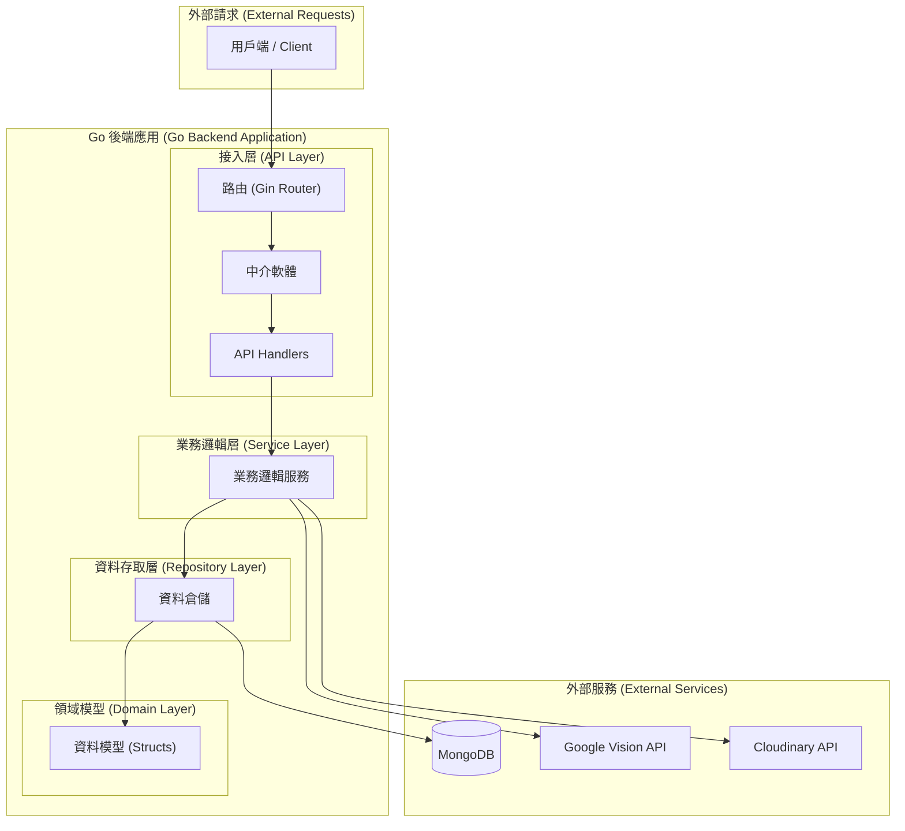
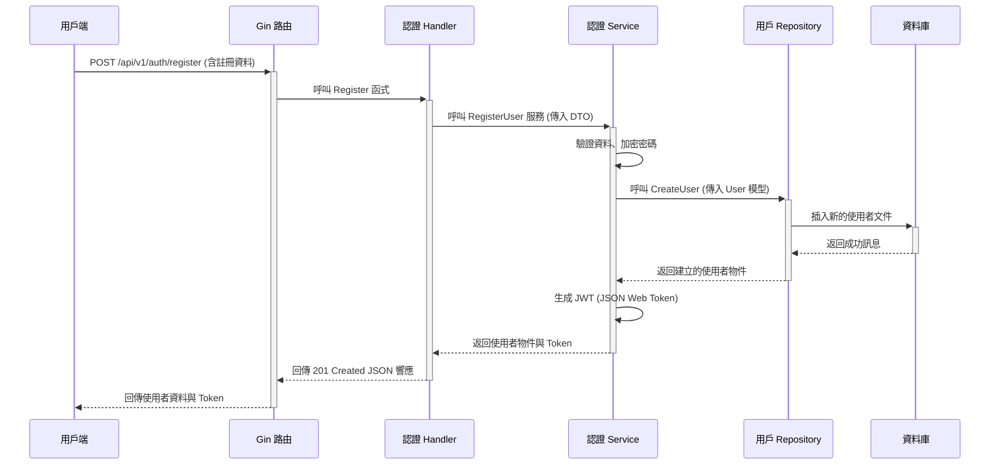

# TaiwanStay Go 後端開發指南

本文檔是 `taiwanstay-back` 專案的核心開發指南，整合了專案架構、API 遷移計畫、開發與測試流程、以及 AI 協作規範。所有開發者都應以此文件為準。

---

## 1. 專案架構 (Architecture)

### 1.1. 核心技術棧

| 類別 | 推薦函式庫 | 說明 |
| :--- | :--- | :--- |
| **Web 框架** | [Gin](https://github.com/gin-gonic/gin) | 一個高效能、API 精簡的 Web 框架。社群龐大，文件豐富，對新手友好。 |
| **資料庫驅動** | [Official MongoDB Driver](https://github.com/mongodb/mongo-go-driver) | 官方支援的 MongoDB 驅動，穩定可靠。 |
| **環境變數管理** | [Viper](https://github.com/spf13/viper) | 強大的設定檔管理工具，能輕鬆讀取 `.env` 檔案和 YAML。 |
| **請求驗證** | [Validator v10](https://github.com/go-playground/validator) | 基於 struct tag 的驗證函式庫，可以與 Gin 完美整合。 |
| **相依性管理** | Go Modules (內建) | Go 官方的相依性管理工具。 |

### 1.2. 專案結構 (Project Layout)

我們採用一個清晰的、分層的專案結構，以實現關注點分離。

```
/taiwanstay-back
├── cmd/
│   └── server/
│       └── main.go            # 程式進入點，初始化與啟動伺服器
├── internal/
│   ├── api/                   # HTTP Handlers (控制器)
│   ├── service/               # 業務邏輯層
│   ├── repository/            # 資料存取層
│   └── domain/                # 核心領域模型 (資料結構)
├── pkg/
│   ├── config/                # 設定檔讀取 (Viper)
│   └── database/              # 資料庫連線
├── .env.example               # 環境變數範例
├── go.mod                     # Go Modules 檔案
└── go.sum
```

### 1.3. 系統分層架構圖 (Layered Architecture)

此圖展示了系統的核心分層結構，以及各層之間的單向依賴關係。



---

## 2. API 遷移計畫

本文檔根據 `taiwanstay-front/pages/api` 目錄下的實際程式碼進行規劃，旨在將現有 API 端點準確地遷移至 `taiwanstay-back` (Go) 後端。

### 2.1. 待遷移的 API 端點

-   **/api/auth**: 處理用戶註冊、登入等身份驗證。
-   **/api/users**: 管理員對用戶的 CRUD 操作。
-   **/api/user**: 處理當前登入用戶的資料查詢與更新。
-   **/api/opportunities**: 工作機會的 CRUD 操作與搜尋。
-   **/api/organizations**: 組織的 CRUD 操作。
-   **/api/applications**: 申請的 CRUD 操作。
-   **/api/hosts**: 主人 (Host) 的 CRUD 操作。
-   **/api/bookmarks**: 書籤功能。
-   **/api/notifications**: 通知功能。
-   **/api/admin**: 管理員專用端點。
-   **/api/check-image**: 圖片安全審核 (需整合 Google Vision API)。
-   **/api/upload** & **/api/cloudinary**: 檔案（主要是圖片）上傳功能。
-   **/api/seed**: 資料庫填充腳本。此功能建議在 Go 後端改為一個獨立的 CLI 命令 (`cmd/seeder/main.go`)。

### 2.2. Go 後端對應結構規劃

| 資源 (Domain) | 路由前綴 (Route Prefix) | Handler | Service | Repository | Domain |
| :--- | :--- | :--- | :--- | :--- | :--- |
| **認證** | `/api/v1/auth` | `auth_handler.go` | `auth_service.go` | `user_repo.go` | `user.go`, `token.go` |
| **用戶** | `/api/v1/users` | `user_handler.go` | `user_service.go` | `user_repo.go` | `user.go` |
| **工作機會** | `/api/v1/opportunities` | `opportunity_handler.go` | `opportunity_service.go` | `opportunity_repo.go` | `opportunity.go` |
| **組織** | `/api/v1/organizations` | `organization_handler.go` | `organization_service.go` | `organization_repo.go` | `organization.go` |
| **申請** | `/api/v1/applications` | `application_handler.go` | `application_service.go` | `application_repo.go` | `application.go` |
| **主人** | `/api/v1/hosts` | `host_handler.go` | `host_service.go` | `host_repo.go` | `host.go` |
| **書籤** | `/api/v1/bookmarks` | `bookmark_handler.go` | `bookmark_service.go` | `bookmark_repo.go` | `bookmark.go` |
| **通知** | `/api/v1/notifications` | `notification_handler.go` | `notification_service.go` | `notification_repo.go` | `notification.go` |
| **圖片上傳** | `/api/v1/upload` | `upload_handler.go` | `upload_service.go` | `(Cloudinary)` | `media.go` |
| **圖片審核** | `/api/v1/images/check` | `image_check_handler.go` | `image_check_service.go` | `(Google Vision)` | `media.go` |

### 2.3. API 端點實作狀態

| 狀態 | HTTP 方法 | 端點 | 說明 |
| :---: | :--- | :--- | :--- |
| ✅ | `POST` | `/api/v1/auth/register` | 使用者註冊 |
| ✅ | `POST` | `/api/v1/auth/login` | 使用者登入 |
| | `POST` | `/api/v1/auth/logout` | 使用者登出 |
| | `GET` | `/api/v1/users` | 取得所有使用者 (管理員) |
| | `GET` | `/api/v1/users/:id` | 取得單一使用者 (管理員) |
| | `GET` | `/api/v1/user/me` | 取得當前登入者資訊 |
| | `PUT` | `/api/v1/user/me` | 更新當前登入者資訊 |

---

## 3. 開發與測試流程

### 3.1. 開發流程閉環

對於每一個新的 API 端點，都必須遵循以下**開發與測試的完整閉環**：

1.  **Domain 層**: 在 `internal/domain/` 中定義或確認資料模型。
2.  **Repository 層**: 在 `internal/repository/` 中定義介面並實作資料庫操作。
3.  **Service 層**: 在 `internal/service/` 中定義介面並實作業務邏輯。
4.  **Handler 層**: 在 `internal/api/` 中建立 Handler 方法處理 HTTP 請求。
5.  **Router 層**: 在 `internal/api/router.go` 中註冊路由。

### 3.2. 請求流程範例 (使用者註冊)



### 3.3. 自動化測試策略

我們採用分層的測試方法，以確保從最小的邏輯單元到完整的 API 端點都得到驗證。

**A. 推薦函式庫**

| 類別 | 推薦函式庫 | 說明 |
| :--- | :--- | :--- |
| **測試框架** | Go `testing` (內建) | Go 官方的測試框架。 |
| **斷言** | `testify/assert` | 提供豐富的斷言函式，使測試更具可讀性。 |
| **Mock 工具** | `testify/mock` | 用於建立相依項的 mock 物件，實現隔離測試。 |
| **整合測試** | `net/http/httptest` (內建) | 用於建立模擬的 HTTP 請求與回應。 |
| **測試資料庫** | `testcontainers-go` | 以程式化方式管理 Docker 容器，為整合測試提供乾淨的資料庫環境。 |

**B. 單元測試 (Unit Tests)**

-   **目標**: 專注於測試單一的功能模組 (例如 `Service` 層的業務邏輯)，並與外部相依 (如資料庫) 完全隔離。
-   **位置**: 測試檔案 (`*_test.go`) 應與被測試的原始碼檔案放在同一個目錄下，並使用相同的 `package` 名稱。
-   **核心實踐**:
    -   使用 `testify/mock` 模擬 `Repository` 層，避免與真實資料庫互動。
    -   測試應快速、穩定且可重複執行。
-   **範例 (`internal/service/user_service_test.go`)**:
    ```go
    package service

    import (
        "context"
        "testing"
        "github.com/stretchr/testify/assert"
        "github.com/stretchr/testify/mock"
        "go.mongodb.org/mongo-driver/mongo"
    )

    // 建立 mock repository
    type mockUserRepository struct {
        mock.Mock
    }

    // 實作 mock 方法
    func (m *mockUserRepository) GetByEmail(ctx context.Context, email string) (*domain.User, error) {
        args := m.Called(ctx, email)
        // ...
    }

    func TestLoginUser_UserNotFound(t *testing.T) {
        mockRepo := new(mockUserRepository)
        // 設定 mock 期望：當 GetByEmail 被呼叫時，回傳 ErrNoDocuments
        mockRepo.On("GetByEmail", mock.Anything, "notfound@example.com").Return(nil, mongo.ErrNoDocuments)

        userService := NewUserService(mockRepo)
        _, _, err := userService.LoginUser(context.Background(), "notfound@example.com", "password")

        // 斷言：錯誤應為 ErrInvalidCredentials
        assert.Error(t, err)
        assert.Equal(t, ErrInvalidCredentials, err)
        mockRepo.AssertExpectations(t) // 驗證 mock 是否被如期呼叫
    }
    ```

**C. 整合測試 (Integration Tests)**

-   **目標**: 測試多個元件協同工作的正確性，特別是從 HTTP `Handler` 到資料庫的完整流程。
-   **位置**: 測試檔案 (`*_test.go`) 通常放在 `api` 套件目錄下，用於測試 API 端點。
-   **核心實踐**:
    -   使用 `testcontainers-go` 在測試執行期間動態啟動一個乾淨的資料庫容器。
    -   使用 `net/http/httptest` 模擬真實的 HTTP 請求。
    -   直接與測試資料庫進行互動，驗證資料的正確性。
-   **範例 (`internal/api/router_test.go`)**:
    ```go
    package api

    import (
        "net/http"
        "net/http/httptest"
        "testing"
        "github.com/gin-gonic/gin"
        "github.com/stretchr/testify/assert"
    )

    func TestRegister_Success(t *testing.T) {
        // 1. 使用 testcontainers-go 設定測試資料庫
        collection, cleanup := setupTestMongoDB(context.Background())
        defer cleanup()

        // 2. 設定測試用的 Gin 路由器
        router := setupTestRouter(collection)

        // 3. 準備並發送 HTTP 請求
        body := bytes.NewBufferString(`{"name":"test", "email":"test@test.com", "password":"password"}`)
        req, _ := http.NewRequest("POST", "/api/v1/auth/register", body)
        req.Header.Set("Content-Type", "application/json")

        w := httptest.NewRecorder()
        router.ServeHTTP(w, req)

        // 4. 斷言 HTTP 狀態碼和回應內容
        assert.Equal(t, http.StatusCreated, w.Code)
    }
    ```

**D. 測試執行**

-   **執行所有測試**:
    ```bash
    go test ./...
    ```
-   **執行特定套件的測試**:
    ```bash
    go test ./internal/service
    ```
-   **查看測試覆蓋率**:
    ```bash
    go test -coverprofile=coverage.out ./...
    go tool cover -html=coverage.out
    ```

**E. 持續整合 (CI)**
所有程式碼變更都需通過 `.github/workflows/ci.yml` 中定義的 Lint 和 Test 檢查，確保程式碼品質。

---

## 4. 日誌與錯誤處理

### 4.1. 日誌記錄規範 (Logging Strategy)

**A. 推薦函式庫：`Logrus`**
- **優點**：支援結構化日誌 (JSON 格式)、可自訂日誌級別、並且與 Go 標準日誌庫相容。

**B. 日誌級別 (Log Levels)**
- `Debug`: 僅在開發環境中啟用，用於記錄詳細的程式執行資訊。
- `Info`: 記錄應用的正常操作事件。
- `Warn`: 記錄可預期的、不會中斷服務但需要注意的事件。
- `Error`: 記錄導致某個操作失敗的錯誤，**必須包含詳細的 `error` 資訊**。
- `Fatal`: 記錄導致整個應用程式必須立即終止的嚴重錯誤。

**C. 結構化日誌格式 (JSON)**
所有日誌都應以 JSON 格式輸出，方便日誌收集系統進行解析和查詢。
```json
{
  "timestamp": "2025-10-25T04:01:12Z",
  "level": "error",
  "message": "Failed to process user registration",
  "request_id": "a1b2c3d4-e5f6-7890-1234-567890abcdef",
  "service": "UserService",
  "error": "duplicate key error: email already exists"
}
```

### 4.2. 統一的錯誤處理機制 (Error Handling)

**A. 統一錯誤回應格式**
所有 API 錯誤都應回傳此 JSON 結構：
```json
{
  "error": {
    "code": "UNIQUE_CONSTRAINT_VIOLATED",
    "message": "A user with this email already exists."
  }
}
```
對於包含多個欄位驗證的錯誤，可以增加 `details` 欄位：
```json
{
  "error": {
    "code": "VALIDATION_ERROR",
    "message": "Input validation failed.",
    "details": [
      {
        "field": "email",
        "issue": "Must be a valid email format."
      },
      {
        "field": "password",
        "issue": "Password must be at least 8 characters long."
      }
    ]
  }
}
```

**B. HTTP 狀態碼與錯誤碼對應**
- `400 Bad Request`: 用於請求格式錯誤或業務邏輯驗證失敗 (`VALIDATION_ERROR`)。
- `401 Unauthorized`: 用於 JWT Token 無效或未提供。
- `403 Forbidden`: 用於已登入但無權限訪問某資源。
- `404 Not Found`: 用於請求的資源不存在 (`RESOURCE_NOT_FOUND`)。
- `409 Conflict`: 用於資源衝突 (`UNIQUE_CONSTRAINT_VIOLATED`)。
- `500 Internal Server Error`: 用於所有未被捕獲的伺服器內部錯誤 (`INTERNAL_SERVER_ERROR`)。

---

## 5. AI 協作指南 (Continuation Prompt)

### 5.1. 核心原則

你 (AI) 必須嚴格遵守本文檔建立的架構、規範和開發模式。

### 5.2. 程式碼風格與規範

-   **顯式優於隱式**: 嚴格遵守手動依賴注入。
-   **介面導向**: 所有 `Repository` 和 `Service` 都必須先定義介面。
-   **錯誤處理**: 嚴格處理所有函式可能回傳的 `error`。
-   **安全性**: 密碼等敏感資訊必須加密處理。
-   **持續整合 (CI)**: 確保所有程式碼變更都能通過 CI 檢查。
