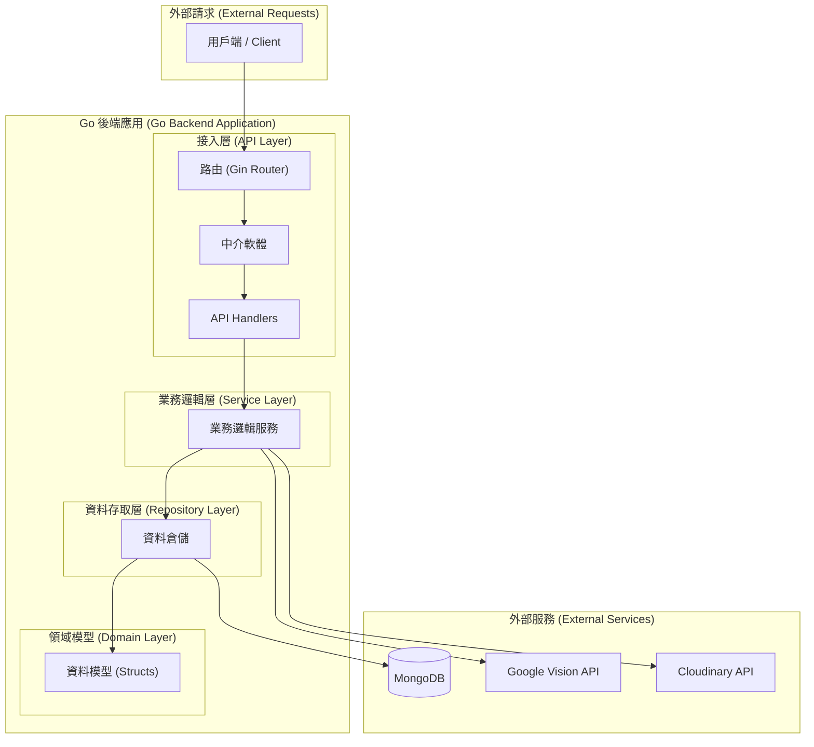
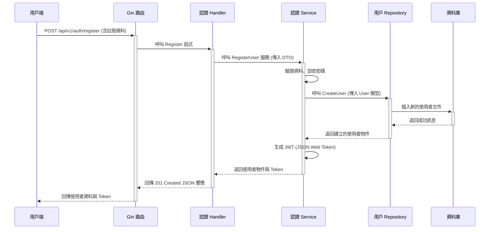

# TaiwanStay 後端架構圖 (Mermaid)

本文檔使用 Mermaid 語法繪製了 `taiwanstay-back` 專案的系統架構圖與請求流程圖，以視覺化方式呈現系統設計。

## 1. 系統分層架構圖 (Layered Architecture)

此圖展示了系統的核心分層結構，以及各層之間的單向依賴關係。

## 2. 使用者註冊請求流程圖 (Sequence Diagram)

此圖以「使用者註冊」(故事 1.1) 為例，展示了一個典型請求在系統各層之間的詳細處理流程。

## 3. 總結

-   **分層架構圖** 宏觀地展示了系統的模組劃分和依賴方向，確保了程式碼的低耦合與高內聚。
-   **序列圖** 微觀地展示了單一功能（如註冊）的完整生命週期，有助於理解程式碼的執行細節，並可作為撰寫整合測試的參考。
